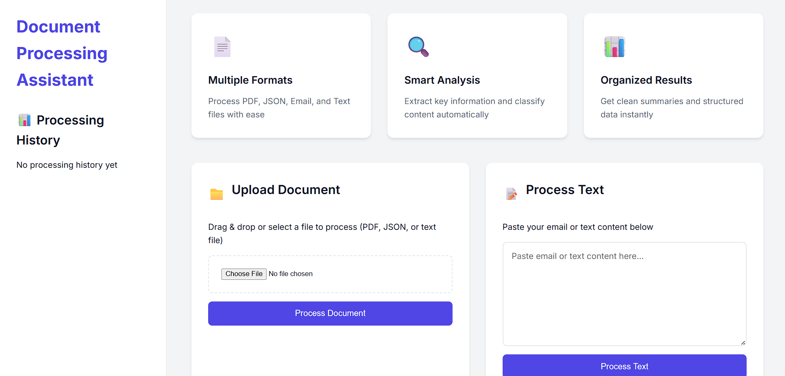

# Smart Document Processing System
🌐 **Live Demo:** [https://any-document-processing-agent.vercel.app/](https://any-document-processing-agent.vercel.app/)

A modern web application for processing and analyzing various document formats including PDF, JSON, and Email content. Built with FastAPI and modern web technologies.




## Features

- 📄 **Multi-Format Support**: Process PDF, JSON, Email, and Text files
- 🔍 **Smart Analysis**: Automatic content classification and information extraction
- 📊 **Organized Results**: Clean summaries and structured data output
- 💾 **Processing History**: Track and review previous document processing
- 🎨 **Modern UI**: Responsive design that works on all devices
- ⚡ **Real-time Processing**: Instant feedback and results


## Tech Stack

- Backend: FastAPI (Python)
- Frontend: Vanilla JavaScript, Modern CSS
- Document Processing: Custom agents for different file types
- Storage: SQLite for processing history

## Getting Started

### Prerequisites

- Python 3.8 or higher
- pip (Python package manager)

### Installation

1. Clone the repository:
```bash
git clone https://github.com/yourusername/document-processing-system.git
cd document-processing-system
```

2. Install dependencies:
```bash
pip install -r requirements.txt
```

3. Run the application:
```bash
python -m uvicorn main:app --reload
```

4. Open your browser and navigate to:
```
http://localhost:8000
```

## Usage

### 1. Document Upload

- Click the upload section to select a file
- Supports PDF, JSON, and text files
- Drag and drop is supported

### 2. Text Processing

- Paste your content in the text area
- Click "Process Text" to analyze

### 3. View Results

- Results are displayed immediately after processing
- History is maintained in the sidebar
- Click on history items to view past results

## Project Structure

```
.
├── agents/             # Document processing agents
│   ├── classifier.py   # Content classification
│   ├── email_agent.py  # Email processing
│   ├── json_agent.py   # JSON processing
│   └── pdf_agent.py    # PDF processing
├── memory/            # Storage components
│   └── memory_store.py # Processing history storage
├── utils/             # Utility functions
├── assets/           # Application assets
│   └── images/       # Screenshots and images
├── main.py           # Main application file
└── requirements.txt  # Project dependencies
```

## Contributing

Contributions are welcome! Please feel free to submit a Pull Request.

## License

This project is licensed under the MIT License - see the LICENSE file for details. 
